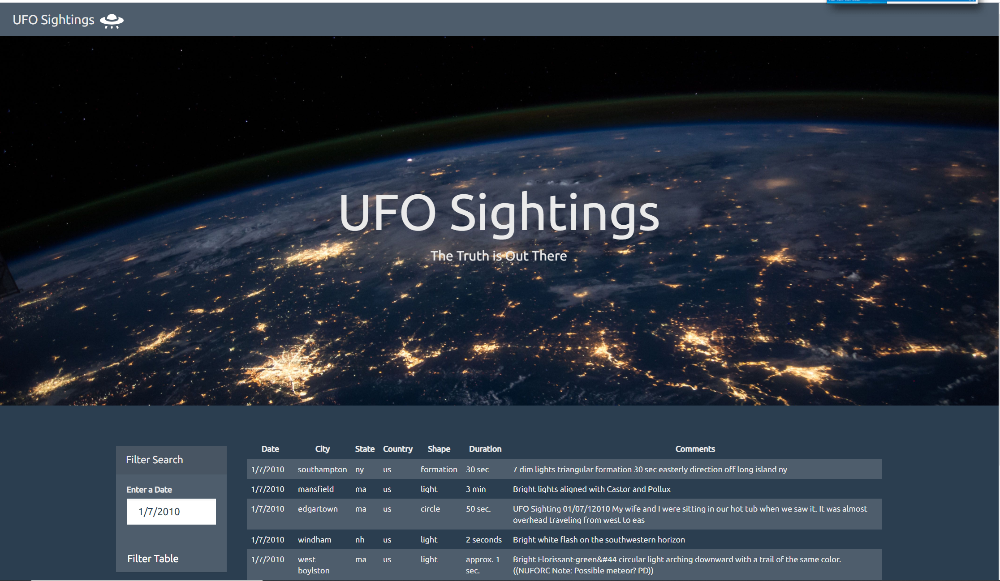

# javascript-challenge

A dataset was provided that represented a collection of the eye-witness reports of UFO sightings.  A dynamic website was created using JavaScript, HTML, CSS, and D3.js to allow users to filter the table data for UFO sightings on a specific date. See the screenshot below of the webpage that was created using a date filter.

